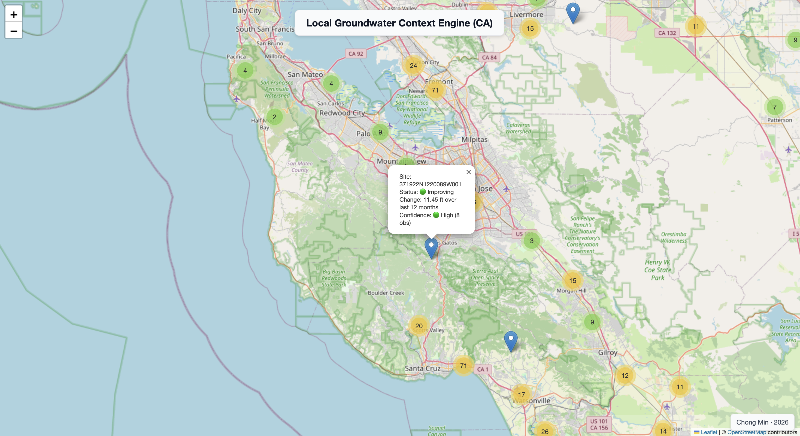

# Local Groundwater Context Engine  
Chong Min
## Overview
This project builds an end-to-end system that ingests groundwater well data and transforms it into simple, interpretable signals for decision-making.

It focuses on turning messy environmental time series data into clear indicators of local groundwater trends and confidence.
## Demo Preview

## Live Demo
https://chongmindev.github.io/local-groundwater-context-engine/map.html
## Current Functionalities
- Data ingestion from public API into local database

- Per-site data retrieval and querying

- Computation of groundwater trend (score) and data reliability (confidence)

- Geospatial visualization of wells across California

## Data Source
Data from the California Department of Water Resources (DWR)  
Periodic Groundwater Level Measurements Dataset: https://data.cnra.ca.gov/dataset/periodic-groundwater-level-measurements  
Accessed via CKAN API